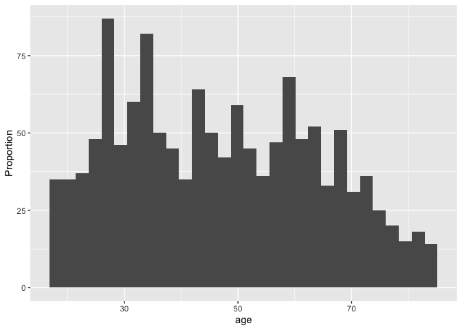
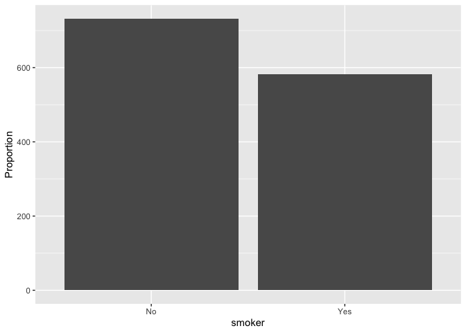
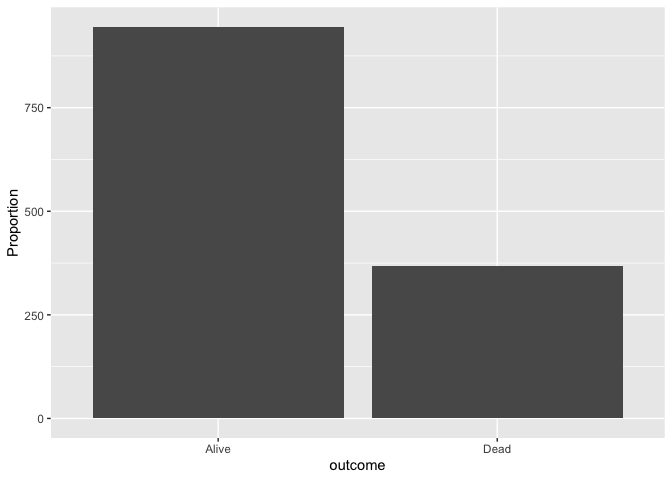
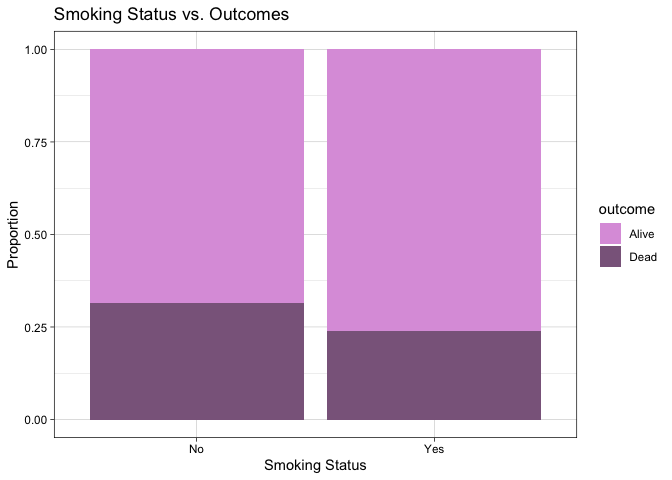
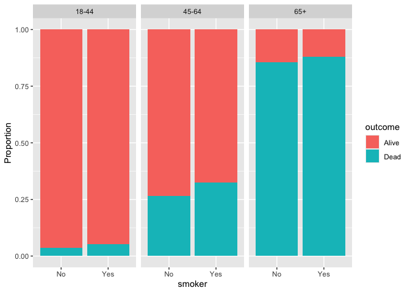

Lab 06 - Ugly charts and Simpson’s paradox
================
Anaelle Gackiere
02-20-2026

### Load packages and data

``` r
library(tidyverse) 
library(dsbox)
library(mosaicData) 
```

``` r
data(Whickham)

?Whickham
```

### Exercise 1

This is an observational study, because the data comes from a survey
that asks for their smoking status, age, and then the survival status is
measured 20 years after, but no manipulation of variables is present. As
the data description describes, “Data on age, smoking, and mortality
from a one-in-six survey of the electoral roll in Whickham \[…\] the
survey was conducted in 1972-1974 to study heart disease and thyroid
disease. A follow-up on those in the survey was conducted twenty years
later.”

### Exercise 2

How many observations are in this dataset? What does each observation
represent?

There are 1314 observations on women, each of which has their age,
smoking status at baseline, and survival status.

### Exercise 3

How many variables are in this dataset? What type of variable is each?
Display each variable using an appropriate visualization.

There are three variables in this data set (age, smoker, outcome). The
outcome variable is a factor with two levels: Alive and Dead. The smoker
variable is a factor with two levels: No and Yes. The age variable is a
continuous one, and it is classified as an integer.

``` r
# class check
class(Whickham$age)
```

    ## [1] "integer"

``` r
class(Whickham$outcome)
```

    ## [1] "factor"

``` r
class(Whickham$smoker)
```

    ## [1] "factor"

``` r
# display age
ggplot(Whickham, aes(age)) +
  geom_histogram(fill = "plum") +
  labs(title = "Age of Women in the Whickham Data Frame",
       y = "Proportion",
       x = "Age") +
  theme_linedraw()
```

    ## `stat_bin()` using `bins = 30`. Pick better value `binwidth`.

<!-- -->

``` r
# display smoker
ggplot(Whickham, aes(x = smoker, fill = smoker)) +
  geom_bar() +
  labs(title = "Smoker Status of Women in the Whickham Data Frame",
       y = "Proportion",
       x = "Smoker") +
  scale_fill_manual(values = c("Yes" = "plum", "No" = "plum4")) +
  theme_linedraw()
```

<!-- -->

``` r
# display outcome
ggplot(Whickham, aes(x = outcome, fill = outcome)) +
  geom_bar() +
  labs(y = "Proportion",
       x = "Outcome",
       title = "Outcomes of Women in the Whickham Data Frame") +
  scale_fill_manual(values = c("Alive" = "plum", "Dead" = "plum4")) +
  theme_linedraw()
```

<!-- -->

…

### Exercise 4

What would you expect the relationship between smoking status and health
outcome to be?

I would expect yes in the smoking status would be positively associated
with Dead in the outcome.

### Exercise 5

I did not expect to see that more women who did NOT smoke died, compared
to women who smoked.

``` r
# visual
ggplot(Whickham, aes(x = smoker, fill = outcome)) +
  geom_bar(position = "fill") +
  labs(y = "Proportion",
       x = "Smoking Status",
       title = "Smoking Status vs. Outcomes") +
  scale_fill_manual(values = c("Alive" = "plum", "Dead" = "plum4")) +
  theme_linedraw()
```

<!-- -->

``` r
# calculate proportions and make a table of it
Whickham %>%
  count(smoker, outcome) %>%
  group_by(smoker) %>%
  mutate(prop = n / sum(n))
```

    ## # A tibble: 4 × 4
    ## # Groups:   smoker [2]
    ##   smoker outcome     n  prop
    ##   <fct>  <fct>   <int> <dbl>
    ## 1 No     Alive     502 0.686
    ## 2 No     Dead      230 0.314
    ## 3 Yes    Alive     443 0.761
    ## 4 Yes    Dead      139 0.239

…

### Exercise 6

``` r
# new age variable (categories)
Whickham <- Whickham %>%
  mutate(age_cat = case_when(
    age <= 44 ~ "18-44",
    age > 44 & age <= 64 ~ "45-64",
    age > 64 ~ "65+"
  ))
# check it worked 
head(Whickham$age_cat)
```

    ## [1] "18-44" "18-44" "65+"   "65+"   "45-64" "18-44"

### Exercise 7

Now that we take age into consideration, the outcome is what I
predicted: out of women who died, there were more of them who smoked
than those who did not. As age increases, so does the proportion of
people who die, and the proportion of women who smoke and died is
greater than the proportion of women who did not smoke and died for all
age groups.

``` r
# visual 
ggplot(Whickham, aes(x = smoker, fill = outcome)) +
  geom_bar(position = "fill") +
  facet_wrap(vars(age_cat)) +
  labs(y = "Proportion") +
  scale_fill_manual(values = c("Alive" = "plum", "Dead" = "plum4")) +
  theme_linedraw()
```

<!-- -->

``` r
# contingency table
Whickham %>%
  count(age_cat, smoker, outcome) %>%
  group_by(age_cat, smoker) %>%
  mutate(prop = n / sum(n))
```

    ## # A tibble: 12 × 5
    ## # Groups:   age_cat, smoker [6]
    ##    age_cat smoker outcome     n   prop
    ##    <chr>   <fct>  <fct>   <int>  <dbl>
    ##  1 18-44   No     Alive     327 0.965 
    ##  2 18-44   No     Dead       12 0.0354
    ##  3 18-44   Yes    Alive     270 0.947 
    ##  4 18-44   Yes    Dead       15 0.0526
    ##  5 45-64   No     Alive     147 0.735 
    ##  6 45-64   No     Dead       53 0.265 
    ##  7 45-64   Yes    Alive     167 0.676 
    ##  8 45-64   Yes    Dead       80 0.324 
    ##  9 65+     No     Alive      28 0.145 
    ## 10 65+     No     Dead      165 0.855 
    ## 11 65+     Yes    Alive       6 0.12  
    ## 12 65+     Yes    Dead       44 0.88
